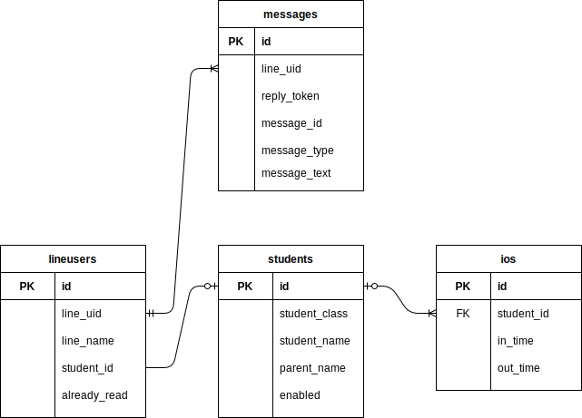

# 機能仕様

## 画面一覧

| 機能名 | URL | 詳細 |
| --- | --- | --- |
| 打刻画面 | /ios/new | 生徒が打刻する画面 |
| 生徒一覧 | /students/ |　在籍生徒の一覧　|
|　生徒新規登録 | /students/new | 生徒の新規登録 |
|　生徒情報編集 | /students/edit | 登録済み生徒の情報の編集 |
|　受信メッセージ一覧 | /messages | 友達追加後の受信メッセージ |
|　LINEID 紐付け | /lineusers | 受信メッセージからの生徒とLINEIDとの紐付け |

## ER図

## DBテーブル

### students

| PK/FK | Attribute | Type | Validation |
| --- | --- | --- | --- |
| PK | id | int | auto_increment |
|| student_class | string ||
|| student_name | string | required:true |
|| parent_name | string ||
|| line_id | string ||
|| enabled | boolean ||

## 画面遷移図

## 登録画面

### 初期値

### エラーチェック

### イベント

### その他仕様

## 検索画面

### 初期値

### エラーチェック

### イベント

### その他仕様

## 照会画面

### 初期値

### エラーチェック

### イベント

### その他仕様

## 更新画面

### 初期値

### エラーチェック

### イベント

### その他仕様